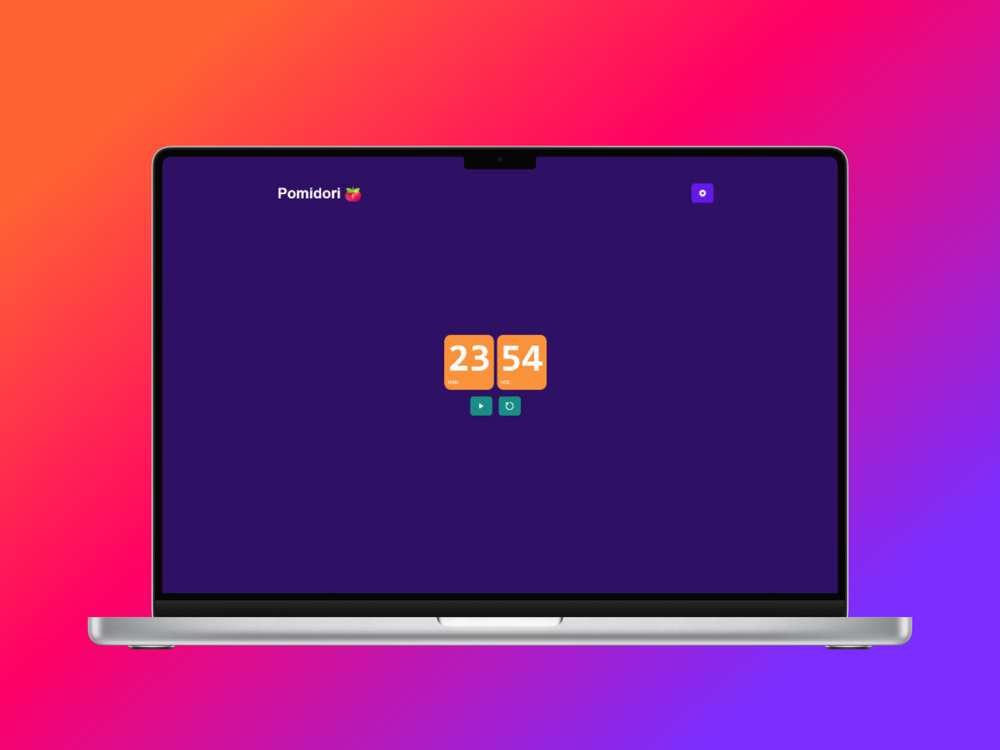

# Pomidori 🍅

Pomidori es una aplicación de escritorio para la técnica de Pomodoro. Esta técnica consiste en dividir el tiempo en bloques de 25 minutos, llamados pomodoros, seguidos de un descanso de 5 minutos. Después de 4 pomodoros, se toma un descanso de 15 minutos.

De momento, Pomidori solo está disponible para Windows.

